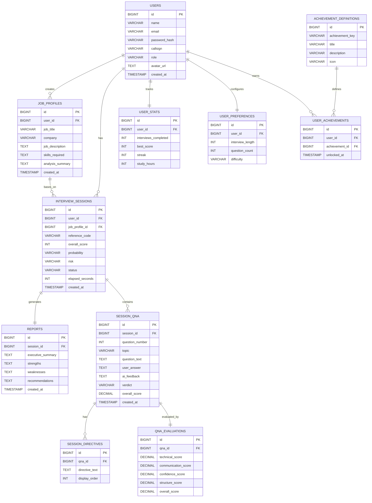

📄 Licensed for portfolio and educational reference only — see [LICENSE](./LICENSE) for details.
#  AI Interview Coach

A full-stack AI-powered interview simulator that transforms any job description into a realistic, adaptive technical interview — generating role-specific questions, evaluating answers across multiple dimensions, and delivering a comprehensive readiness report powered by Google Gemini.

**🔗 Live Demo:** [ai-interview-coach-flame-mu.vercel.app](https://ai-interview-coach-flame-mu.vercel.app)
**🔧 API:** [ai-interview-coach-api-cq59.onrender.com](https://ai-interview-coach-api-cq59.onrender.com)

> ⚠️ Backend is hosted on Render's free tier — the first request after inactivity may take 30–60 seconds to wake up.

---

## 🚀 The Vision: A Flight Simulator for Job Seekers

Practicing for technical interviews is usually frustrating. You either stare at static lists of generic questions, or you try to practice in a mirror without receiving any real feedback.

This project solves interview anxiety by building an **on-demand, tireless AI interviewer** that gives users a realistic, tailored practice run before the real thing — complete with senior-level feedback and a measurable readiness score.

---

## ✨ How It Works

1. **Register & Configure** — Create an account, pick your operator avatar, and set your preferred interview duration and question count. Difficulty is auto-calculated from your selections.
2. **The Setup** — Paste a target job description into the application.
3. **The Customization** — Gemini analyzes the role and dynamically generates technical questions specific to that job's actual requirements — not a generic question bank.
4. **The Hot Seat** — Answer questions one at a time in a focused, distraction-free simulation environment with a live countdown timer. If time runs out, the session auto-submits with whatever was answered.
5. **The Feedback Loop** — Each answer is evaluated in real time across four dimensions: technical depth, communication, confidence, and structure — with specific improvement directives.
6. **The Verdict** — Receive a full diagnostic report: executive summary, strengths, exposed vulnerabilities, per-question breakdown, and tactical study objectives. Exportable as a PDF.
7. **Track Growth** — Analytics dashboard shows score trends, skill breakdowns, and topic distribution across all past sessions. Full archive of every interview, revisitable at any time.

---

## Tech Stack

### Frontend
- **React 19** + **Vite**
- **Redux Toolkit** — global state (auth, interview session, loading, UI)
- **React Router v6**
- **Tailwind CSS v4** — custom cyberpunk/blueprint design system
- **Axios** — API layer with JWT interceptors
- **jsPDF** — client-side PDF report generation
- **Lucide React** — icon system

### Backend
- **Spring Boot 4** (Java 25)
- **Spring Data JPA / Hibernate** — ORM layer
- **Spring Security + JWT** — stateless authentication with a custom `AuthenticatedUser` principal
- **Spring AI** — Google Gemini integration (`gemini-3.1-flash-lite`)
- **MySQL / TiDB Serverless** — relational data store
- **Lombok**
- **BCrypt** — password hashing
- **Docker** — multi-stage production build

### Infrastructure
| Layer | Service |
|---|---|
| Frontend hosting | Vercel |
| Backend hosting | Render (Docker) |
| Database | TiDB Serverless (MySQL-compatible) |
| AI | Google Gemini 3.1 Flash Lite |

---

## 🏗️ Architecture

```
React (Vercel)
     │  JWT Bearer Auth
     ▼
Spring Boot REST API (Render)
     │
     ├── Controller Layer     → thin, delegates to services
     ├── Service Layer        → business logic, orchestration
     ├── GeminiService        → isolated AI wrapper, structured JSON responses
     ├── Repository Layer     → Spring Data JPA
     └── Security Layer       → JwtAuthenticationFilter + AuthenticatedUser principal
     │
     ▼
TiDB Serverless (MySQL)
```

### Key backend design decisions
- **`AuthenticatedUser` custom principal** — avoids extra DB lookups per request by embedding `userId` directly in the JWT and resolving it via `@AuthenticationPrincipal`
- **`/api/users/me/...` route convention** — user identity is derived from the JWT, never trusted from a URL path parameter (prevents IDOR vulnerabilities)
- **Global exception handler** — every API error returns a consistent JSON shape (`status`, `error`, `message`, `path`, `timestamp`)
- **Quota-aware Gemini service** — in-memory daily request tracker with a 90% warning threshold and hard block at 100%, keeping non-AI features (profile, analytics, archive) fully available even when the AI quota is exhausted
- **Batch question generation** — all interview questions are generated in a single Gemini call rather than adaptively per question, minimizing API usage on the free tier
- **MX-record email validation** — registration validates the email domain actually exists and can receive mail, blocking common disposable-email domains

---

## 🗄️ Database Architecture

The application uses a normalized **MySQL** relational database designed to support the complete interview preparation lifecycle, from job analysis and simulation to AI-driven evaluation, reporting, analytics, and achievement tracking.

### Core Design Principles

- **Structured User Ecosystem** — Each user maintains dedicated profile, preference, statistics, and achievement records, allowing personalized interview experiences and long-term progress tracking.
- **Job-Centric Interview Flow** — Users can create multiple job profiles containing analyzed job descriptions. Each profile can serve as the foundation for multiple interview simulations, eliminating redundant job analysis and enabling repeated practice against the same role.
- **Session-Based Architecture** — Every interview session acts as an isolated simulation containing generated questions, user responses, AI feedback, evaluation metrics, and a post-interview report.
- **Multi-Layer AI Evaluation** — Each response is assessed across multiple dimensions — technical knowledge, communication, confidence, and answer structure — providing deeper insight than a single aggregate score.
- **Comprehensive Reporting Engine** — Dedicated report entities store executive summaries, strengths, weaknesses, and improvement recommendations generated after each interview.
- **Ordered Question Flow** — A dedicated `question_number` field guarantees deterministic rendering of interview questions and responses in the exact sequence generated by the AI.
- **Progress Tracking & Gamification** — User statistics and achievement systems provide measurable growth indicators, encouraging continuous interview practice.
- **State-Driven Workflow** — Session status values (`IN_PROGRESS`, `COMPLETED`, `TERMINATED`) enable clean frontend routing and workflow management across the simulation lifecycle.



---

## 🔐 API Overview

| Method | Endpoint | Description |
|---|---|---|
| POST | `/api/auth/register` | Register new user (MX-validated email, avatar required) |
| POST | `/api/auth/login` | Authenticate, returns JWT |
| GET/PATCH | `/api/users/me/profile` | Get/update operator profile |
| GET/PATCH | `/api/users/me/preferences` | Get/update interview length, question count, difficulty |
| GET | `/api/users/me/stats` | Operator statistics |
| POST/GET | `/api/users/me/jobs` | Create/list job profiles |
| POST | `/api/users/me/interviews/start` | Start interview — triggers JD analysis + batch question generation |
| GET | `/api/users/me/interviews/{id}` | Fetch session + questions |
| POST | `/api/users/me/interviews/{id}/questions/{qnaId}/answer` | Submit answer — triggers real-time AI evaluation |
| POST | `/api/users/me/interviews/{id}/complete` | Complete session — triggers final report generation |
| GET | `/api/users/me/interviews/{id}/report` | Fetch final report |
| GET | `/api/users/me/archive` | List all past sessions |
| GET | `/api/users/me/archive/{id}` | Full transcript of a past session |
| GET | `/api/users/me/analytics/summary` | Aggregate performance metrics |
| GET | `/api/users/me/analytics/skills` | Skill dimension breakdown |
| GET | `/api/users/me/analytics/distribution` | Topic distribution across sessions |

All `/api/users/me/**` endpoints derive identity from the JWT — never from a path parameter.

---

## 🖥️ Local Setup

### Prerequisites
- Java 21+ (or 25)
- Node.js 18+
- MySQL 8+
- A Google Gemini API key

### Backend

```bash
cd Backend_P1/ai-interview-coach

# Copy the template and fill in your local values
cp src/main/resources/application.properties.example src/main/resources/application.properties

# Create the database and run the schema
mysql -u root -p < schema.sql

mvn clean install
mvn spring-boot:run
```

### Frontend

```bash
cd Frontend_P1

npm install

# Create .env
echo "VITE_API_URL=http://localhost:8080" > .env

npm run dev
```

---

## ☁️ Deployment

| Component | Platform | Notes |
|---|---|---|
| Frontend | Vercel | Auto-deploys on push to `main`, root directory `Frontend_P1` |
| Backend | Render | Docker-based multi-stage build, root directory `Backend_P1/ai-interview-coach` |
| Database | TiDB Serverless | MySQL-compatible, free tier |

Secrets are injected via environment variables on each platform — no credentials are ever committed to the repository. `application.properties` and `.env` are gitignored; only `.example` templates with `${VAR}` placeholders are tracked.

---

## 📁 Project Structure

```
AI-interview-coach/
├── Backend_P1/
│   └── ai-interview-coach/
│       ├── src/main/java/com/soham/aiinterviewcoach/
│       │   ├── controller/     # REST endpoints
│       │   ├── service/        # Business logic + GeminiService
│       │   ├── repository/     # Spring Data JPA interfaces
│       │   ├── entity/         # JPA entities
│       │   ├── dto/            # Request/response records
│       │   ├── security/       # JWT filter, AuthenticatedUser
│       │   ├── config/         # Security, CORS config
│       │   └── exception/      # Global exception handler
│       └── Dockerfile
│
└── Frontend_P1/
    ├── src/
    │   ├── pages/               # Route-level page components
    │   ├── components/          # Reusable + feature components
    │   ├── redux/features/      # authSlice, interviewSlice, etc.
    │   ├── services/            # Axios API layer
    │   └── config/avatars.js    # Avatar preset config
    └── public/avatars/          # Static avatar assets
```

---

## 🎨 Design System

Custom cyberpunk/blueprint aesthetic built on Tailwind CSS v4 theme tokens — neon-blue accent, monospace typography, brutalist clip-path buttons, scanline animations, and cinematic snap-scroll page layouts (with responsive fallback to natural scroll on mobile).

---

## 📌 Roadmap / Future Improvements

- [ ] Refresh token rotation
- [ ] Resume upload with parsed skill extraction
- [ ] OAuth login (Google)
- [ ] Voice-based answer input
- [ ] Multiple interview themes
- [ ] Docker Compose for full local stack (frontend + backend + MySQL)


---

## 👤 Author

**Soham** — Computer Science undergraduate, IIIT Bhubaneswar

Built as a full-stack portfolio project to simulate realistic AI-powered technical interviews using React, Spring Boot, and Google Gemini.

---

## 📬 Contact & Permissions

If you are interested in collaborating, extending this project, or using it for academic or commercial purposes, please reach out to request permission!

- **Email:** imsoham2004@gmail.com
- **LinkedIn:** www.linkedin.com/in/soham-mishra-ind


---

## 📄 License

This project is available for educational and portfolio reference purposes — see [LICENSE](./LICENSE) for details.
